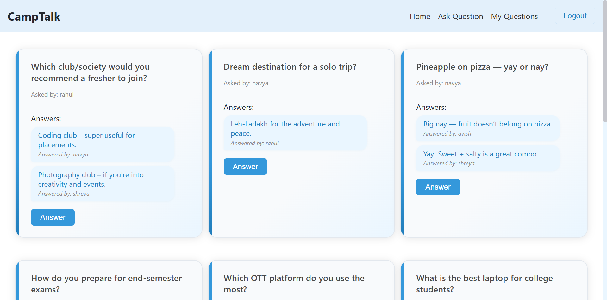
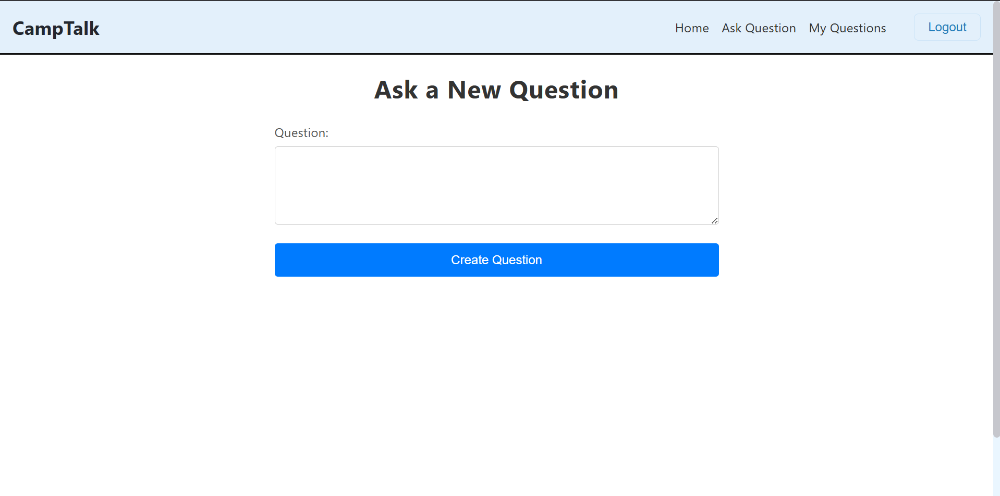
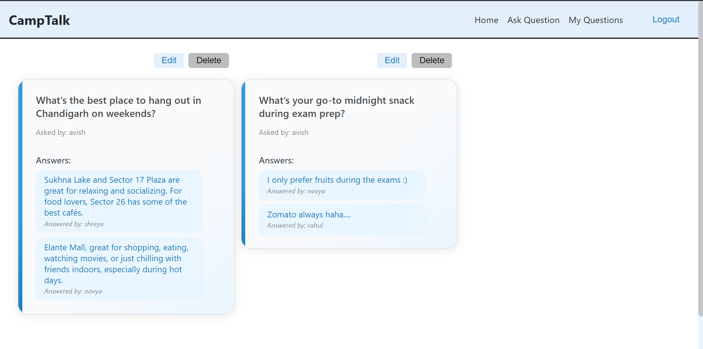
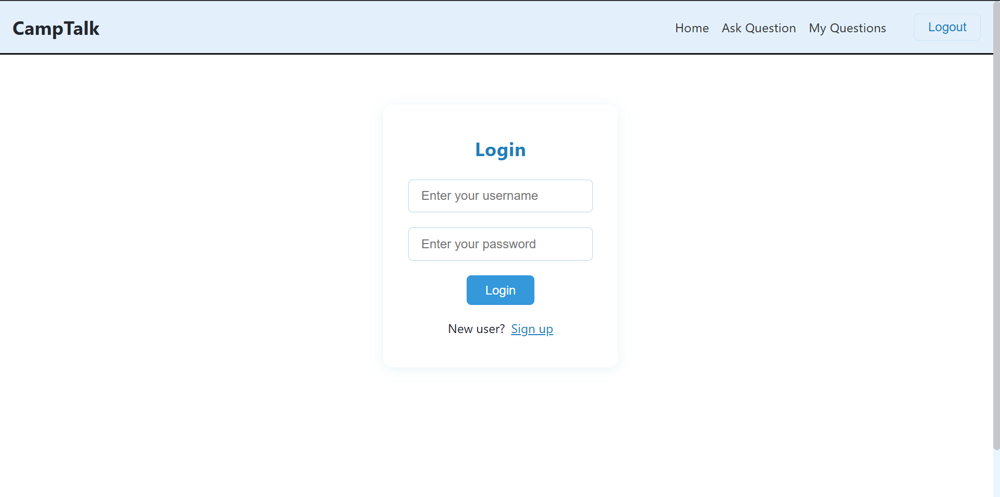

# 🏫 CampTalk – A Student Community Discussion Platform

**CampTalk** is a full-stack MERN (MongoDB, Express.js, React, Node.js) web application that enables students to engage in campus-related or general discussions. Users can post questions, edit them, and reply to others—all within a secure, responsive, and interactive interface.

## 🌐 Live Demo

- 🔗 Frontend (Netlify): [https://camptalk.netlify.app/](https://camptalk.netlify.app/)
- 🔗 Backend (Vercel): https://camp-talk-x5sz.vercel.app/
## ✨ Features

- 🧑‍🎓 Post and edit questions
- 💬 Answer and reply to existing posts
- 🔐 Secure user authentication with hashed passwords (bcrypt)
- 🧾 MongoDB storage for users, posts, and replies
- 📱 Responsive design for desktop and mobile
- 🚀 Deployed with **Netlify (frontend)** and **Vercel (backend)**

## ⚙️ Tech Stack

### 🔹 Frontend
- React
- React Router
- Axios

### 🔹 Backend
- Node.js
- Express.js
- MongoDB (with Mongoose)
- bcrypt (for password hashing)

### 🔹 Dev Tools & Hosting
- Netlify for frontend deployment
- Vercel for backend deployment
- MongoDB Atlas for cloud database

## 📸 Screenshots

### 🏠 Home Page

### ❓ Question Feed

### 📝 View My Questions

### 💬 Login/Signup Page

